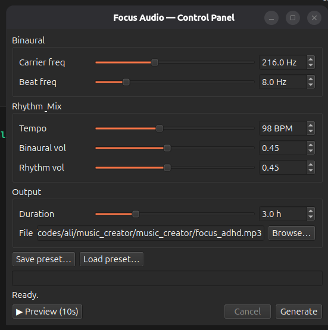

# ADHD Focus Music Generator

A small desktop tool that generates endless, fully adjustable focus audio —
a binaural beat layered with a steady rhythm pulse — and gives you live control
over every part of the sound.

## Why I built this

I have ADHD, and I need music to steady my mind and stay on task. The trouble is
that finding the *right* music is exhausting. There simply isn't enough of it
online — and even when I do find something, it's rarely what I need in the moment.

An ADHD brain doesn't want one fixed track on repeat. It needs to shift the tone,
change the tempo, and stay in control of the sound as the day goes on. No playlist
gives you that.

So instead of hunting for the perfect song, I built a tool that *generates* one.
I can dial in the exact carrier tone, beat frequency, tempo, and volume balance,
preview it instantly, and render hours of focus audio on demand — tuned to
whatever my brain needs right now.

## How it works

The audio is two layers mixed together:

- **Binaural beat** — a base carrier tone in one ear and the same tone plus a small
  offset in the other. The brain perceives the *difference* between them as a slow
  pulse, which is the frequency you tune to a target brain state (see the table below).
- **Rhythm pulse** — a soft, low bass tick at a chosen tempo (BPM) to give the track
  a gentle, steady momentum.

Everything is rendered locally and exported as an MP3 (or WAV).

## Features

The control panel ([`control_panel.py`](control_panel.py)) lets you:

- Adjust **carrier frequency, beat frequency, tempo, binaural volume, rhythm volume,
  and duration** with synced sliders + number boxes.
- **Preview** the current settings as a short clip before committing to a full render.
- **Generate** hours of audio in the background, with a live progress bar and a
  **Cancel** button — the window stays responsive the whole time.
- **Save and load presets** as JSON, so your favorite combinations are one click away.
- **Choose where the file is saved** (`.mp3` or `.wav`).

## Beat frequency guide

Some useful beat-frequency values to experiment with:

| Hz    | Brain state       | Good for                     |
|-------|-------------------|------------------------------|
| 4–7   | Theta             | Deep meditation              |
| 8–13  | Alpha             | Relaxed focus, reading       |
| 14–20 | Beta              | Sharp focus, problem solving |
| 20–40 | High beta / Gamma | Peak alertness               |

## Requirements

- Python 3
- `numpy`, `scipy` — `pip install numpy scipy`
- `PyQt6` — for the control panel — `pip install PyQt6`
- **ffmpeg** installed on your system (<https://ffmpeg.org>), for MP3 export and preview playback

## Usage

**Control panel (GUI):**

```bash
python3 control_panel.py
```

**Command line** (uses the defaults in [`main.py`](main.py)):

```bash
python3 main.py
```

The generation logic lives in [`audio_engine.py`](audio_engine.py) and is shared by
both the GUI and the CLI.

## ⚠️ Headphones required

Binaural beats only work when each ear hears its own channel — always listen with
**stereo headphones**, not speakers.


